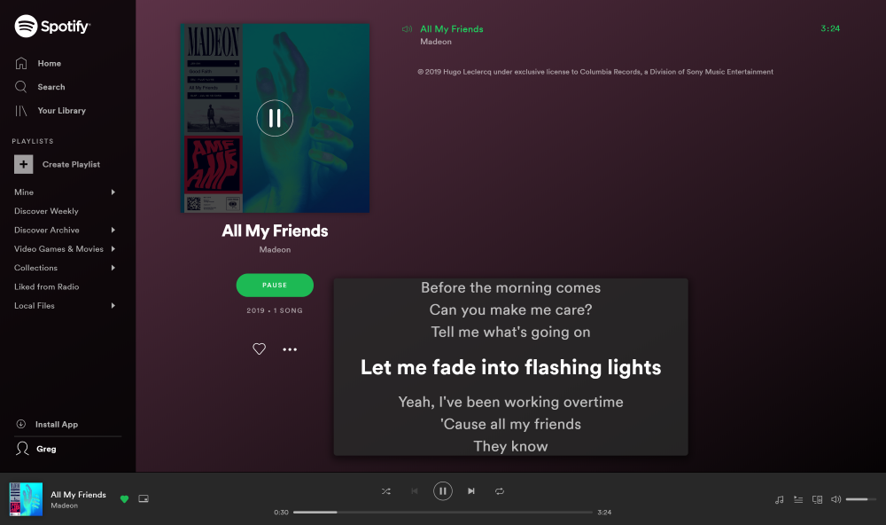
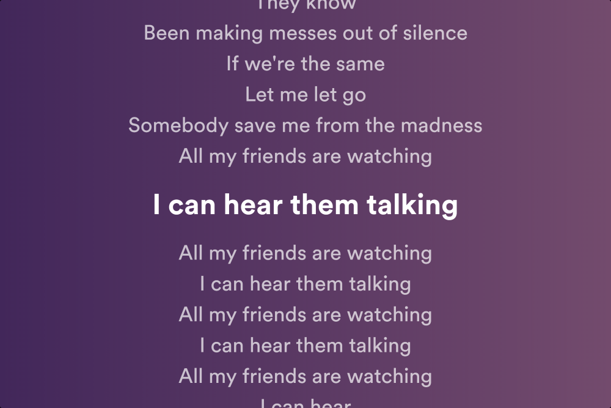

# spotify-lyrics-web
GreaseMonkey / ViolentMonkey script to display lyrics on the Spotify Web Player using Musixmatch.

## Installation
Create a new script in GreaseMonkey / ViolentMonkey, and copy-paste the content of the `index.js` file
into it.

## Usage
A new 🎵 icon will be added next to the "Queue" icon at the bottom-right of the screen. Simply
click it to open or close the lyrics panel, whose content will be automatically filled with lyrics,
and scrolled as the song advances.  
You can also double-click on the lyrics panel to display lyrics in fullscreen.

If an error is encountered (track is instrumental or could not be found), the panel will be hidden
and the icon will be greyed-out; simply hover over it with your mouse to see the reason why
the lyrics could not be found.

## Screenshots

> Lyrics panel

> Full-screen mode

